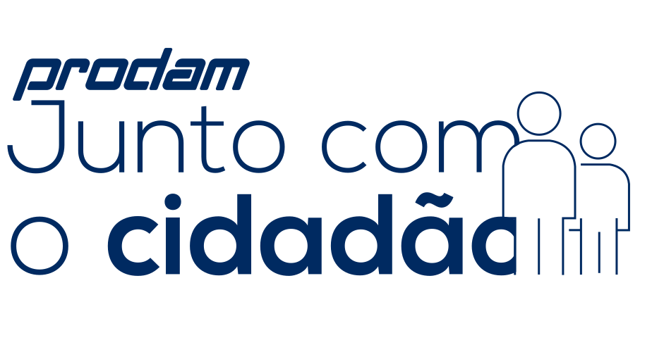
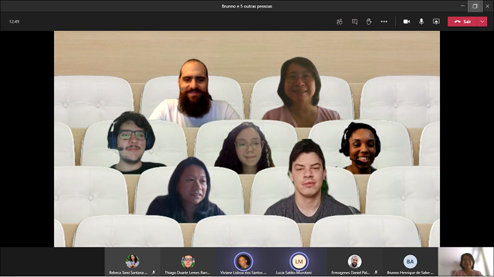
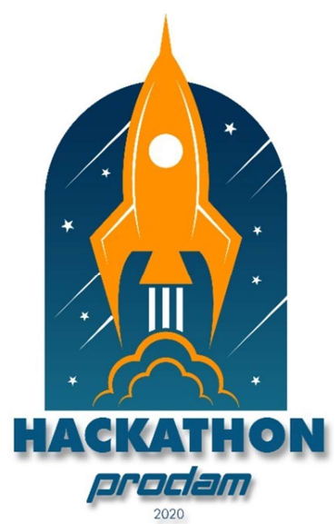

# prodamjuntocomcidadao-web

🥇 Repositório do projeto [prodamjuntocomcidadao], VENCEDOR do Hackathon Prodam 2020/11.

- [📺 Introdução](https://youtu.be/gFL4ylVJzU0)
- [💻 Aplicação em produção](https://prodamjuntocomcidadao.azurewebsites.net/)
- [🐱‍💻 Código-fonte (web)](https://github.com/ermogenes/prodamjuntocomcidadao-web) e [📺 Apresentação no YouTube](https://youtu.be/NC6BnqZn5Z8)
- [📱 Código-fonte (app)](https://github.com/thidulb/Junto-com-cidadao-App)
- [🛢 Banco de dados](https://github.com/ermogenes/prodamjuntocomcidadao-mysql)
- [📈 Painel BI](https://app.powerbi.com/groups/dab57a6a-1238-49b9-9e77-dded825672e1/reports/00de1a4a-b1b6-4b1e-96aa-c8b65fc9fb81/ReportSection)
- [📺 Apresentação - Encerramento do Hackathon Prodam 2020](https://youtu.be/rmdAEXU9cJI)
## Proposta

Criar um canal de comunicação entre o Cidadão e a Prefeitura do Município de São Paulo.

## Problema

Existe uma dificuldade de comunicação entre o cidadão e a Prefeitura de São Paulo e faltam mecanismos para dar visibilidade ao pensamento da população.

## Solução

* Criar um canal mais amigável, mais rápido e fácil para o cidadão dizer o que pensa e permitir o compartilhamento dessas experiências entre os cidadãos;
* Analisar os dados para facilitar o desenho de políticas públicas e atuação das Secretárias ou Órgãos;
* Fornecer subsídios para a proposição de novas apps, funcionalidades, sistemas e outros meios tecnológicos.

## Conjunto de Funcionalidades

* Captação das ideias dos cidadãos;
* Análise do sentimento a partir do texto inserido;
* Painel de monitoramento análitico das críticas, elogios, opiniões, sugestões, soluções, etc.

## Desenho da Solução

A solução web estará hospedada na nuvem Azure, usando o serviço de aplicativos (modelo PaaS). Será desenvolvida em .NET Core, HTML, CSS e JavaScript, com banco de dados MySQL (100% software livre). Os fontes estarão disponíveis no GitHub, e serão publicados usando entrega contínua usando a integração do Azure com o GitHub Actions. A análise de sentimentos será criada com Azure Cognitive Services.

Será utilizada React Native para o app _mobile_.

Os dados serão analisados através do PowerBI.

## Participantes

- Brunno Henrique de Salve Agostinho
- Ermogenes Daniel Palacio
- Lucia Satiko Murotani
- Miriam Mitie Miyashiro
- Rebeca Tami Santana Osanai
- Thiago Duarte Lemes Barreto
- Viviane Lisboa dos Santos Oliveira

